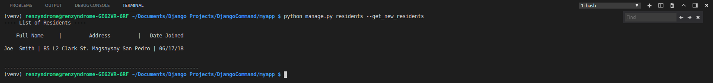

# Django simple CRUD CLI

## Description:
**Perform Create, Read, Update, and Delete Resident's details using this simple app and execute custom commands via command line interface.**

## Usage:

Change working directory to /myapp

**Add a new Resident by inputting:** python manage.py residents --add_resident

**View Residents by inputting:** python manage.py residents --view_people

"Choose Resident's name: " prompt will appear and you can enter the Resident's name to direct you to 'action' prompt.

An Action prompt will let you **Update** or **Delete** a Resident's data. You can press any other key to exit.
"Choose Resident's name: " prompt will appear and you can enter the Resident's name to direct you to 'action' prompt.

**Update Resident by inputting:** x

Enter the details you want to update.

**Delete Redident by inputting:** Assumming that you're at  "--view_people" again, Enter a Resident's name and by this time input "d" key to delete a Resident record.

**Get Resident by last name by inputting:** python manage.py residents --get_resident_by_last_name

Enter the last name of the Resident you want to retrieve.

**View Residents that are updated within a day by inputting:** *python.manage.py residents --get_resident_updated_today

**View Residents that are created within a day by inputting:** *python.manage.py residents --get_new_residents

[nothing follows]
